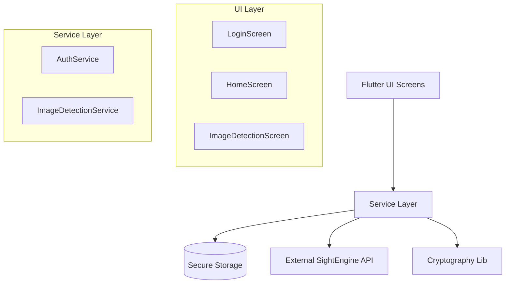

# Technical Documentation: Username Chat App

## 1. Project Overview
**Username Chat App** is a Flutter-based mobile application focused on secure communication and content safety. Key features include decentralized identity management using cryptographic keys and AI-powered image/video moderation.

---

## 2. Algorithms & Core Logic

### A. Authentication (Ed25519)
The app uses a **Key-Based Authentication** system rather than traditional username/passwords. 
*   **Algorithm**: **Ed25519** (Edwards-curve Digital Signature Algorithm).
*   **Process**:
    1.  **Key Generation**: Upon registration, an Ed25519 key pair (Public & Private) is generated locally on the device.
    2.  **Identity**: The **Public Key** serves as the unique User ID.
    3.  **Security**: The **Private Key** is stored securely in the device's Keystore/Keychain using `flutter_secure_storage`. It never leaves the device.

### B. AI Content Moderation
The app does not run heavy AI models locally. Instead, it delegates content analysis to the **SightEngine API**.
*   **Image/Video Analysis**:
    *   Files are uploaded via **Multipart HTTP POST** requests.
    *   **Models Used**: Nudity, WAD (Weapons, Alcohol, Drugs), Offensive, Text-Content, Gore, Gambling.
    *   **Flow**:
        1.  User selects media.
        2.  Media is converted to bytes.
        3.  Bytes are streamed to SightEngine.
        4.  JSON response is parsed to determine safety scores.

### C. Encryption (Web Crypto / JSI)
There is evidence of a JS-Interop layer (`crypto_service.dart`) intended for Web support, utilizing standard Web Crypto APIs for operations like session key generation and text encryption.

---

## 3. Methodology

The project follows an **Iterative & Incremental (Agile)** methodology:

1.  **Component-Based Development**: The UI is built using Flutter's widget tree, promoting reusability (e.g., separate screens for Chat, Settings, Image Detection).
2.  **Service-Oriented Architecture (SOA)**: Business logic is decoupled from UI code.
    *   `AuthService`: Handles key generation and storage.
    *   `ImageDetectionService`: Handles API parsing and network requests.
    *   `CryptoService`: Handles bridging specific cryptographic operations.
3.  **Asynchronous Programming**: Heavy operations (I/O, Network, Crypto) rely on Dart's `Future` and `async/await` pattern to ensure the UI remains non-blocking (60fps).

---

## 4. Requirements

### Functional Requirements
1.  **User Registration**: Generate unique secure identity without email/phone.
2.  **Image Detection**: Upload images to detect sensitive content (nudity, gore, weapons).
3.  **Video Detection**: Support for video content analysis via API.
4.  **Secure Storage**: Persist private keys safely across app restarts.
5.  **Settings Management**: Ability to view profile and clear credentials.

### Non-Functional Requirements
1.  **Security**: Private keys must never be exposed or logged.
2.  **Performance**: Image processing should not freeze the UI.
3.  **Reliability**: Graceful error handling for network failures (API 400/500 errors).
4.  **Privacy**: Adherence to data privacy by not storing sensitive user data on a central server (decentralized approach).

---

## 5. System Design

### Architecture Diagram (Textual)


### Tech Stack
*   **Framework**: Flutter (Dart)
*   **Crypto**: `package:cryptography` (Ed25519), `flutter_secure_storage`
*   **Networking**: `http` package
*   **Media**: `image_picker`
*   **External Service**: SightEngine (Content Moderation)

---

## 6. Implementation Details

### Key Code Snippet: Secure Key Generation
*From `AuthService`*
```dart
Future<String> registerNewUser() async {
  // Use Ed25519 (Modern, fast, and secure)
  final algorithm = Ed25519();
  
  // 1. Generate Key Pair
  final keyPair = await algorithm.newKeyPair();
  
  // 2. Extract & Store Private Key
  final privateKeyBytes = await keyPair.extractPrivateKeyBytes();
  await storage.write(
    key: 'user_private_key', 
    value: base64Encode(privateKeyBytes)
  );

  // 3. Return Public Key as ID
  final publicKey = await keyPair.extractPublicKey();
  return base64Encode(publicKey.bytes);
}
```

### Key Code Snippet: Image Analysis
*From `ImageDetectionService`*
```dart
Future<Map<String, dynamic>> detectImage(XFile imageFile) async {
  var request = http.MultipartRequest('POST', Uri.parse(_apiUrl));
  request.fields['models'] = 'nudity,wad,offensive,gore';
  request.files.add(
    http.MultipartFile.fromBytes(
      'media', 
      await imageFile.readAsBytes(), 
      filename: imageFile.name
    )
  );
  
  var response = await request.send();
  // ... parse JSON response
}
```

---

## 7. Testing Strategy

### A. Unit Testing
*   **Target**: Logic in `Services` independent of UI.
*   **Strategy**: Mock the `http.Client` to simulate API responses (200 OK, 400 Bad Request) without making real network calls. Test that `AuthService` correctly encodes/decodes keys.

### B. Widget Testing
*   **Target**: Individual Screens and Widgets.
*   **Strategy**: Verify that `ImageDetectionScreen` shows a loading spinner while waiting for the API and displays the result text correctly after a response.

### C. Integration Testing
*   **Target**: Complete user flows.
*   **Strategy**: Test the full "Registration -> Navigate to Home -> Upload Image" flow on a real device or emulator to ensure secure storage works with the OS keychain.

---

## 8. Maintenance & Operations

### A. API Key Management
*   **Rotation**: The SightEngine API keys are currently hardcoded. For production, these should be moved to a backend proxy or injected via build environments (`--dart-define`) to allow rotation without app updates.

### B. Dependency Updates
*   Run `flutter pub outdated` regularly to check for security patches in packages like `cryptography` and `http`.

### C. Monitoring
*   **Error Logging**: Implement a service like Sentry or Firebase Crashlytics to catch unhandled exceptions (especially network timeouts or key storage failures) in production.

### D. Scalability
*   **Media Handling**: Currently processes one file at a time. Future maintenance could include queuing systems for batch processing or background uploads for large video files.
